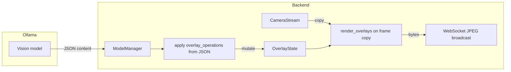

# Ollama camera overlay tools

This document defines how the PC Build Guidance backend lets the Ollama model **annotate the camera feed** with circles, arrows, and clearance commands. Overlays are **composited on the server** onto each outbound JPEG in the WebSocket video stream; the raw `CameraStream` buffer is never modified.

**References**

- Ollama Chat API: [Ollama API — Chat](https://github.com/ollama/ollama/blob/main/docs/api.md) (see request fields including `tools` for a future native-tool path)
- This repo: camera capture in [`backend/camera.py`](../backend/camera.py), JPEG broadcast in [`backend/ws_bridge.py`](../backend/ws_bridge.py), model calls in [`backend/model/gemma.py`](../backend/model/gemma.py), state in [`backend/overlay_state.py`](../backend/overlay_state.py)

## Architecture



**Invariant:** `CameraStream.latest_frame` stays a clean capture. The frame is **copied** before `render_overlays`; annotations exist only in `OverlayState` and on the composited copy used for `cv2.imencode(".jpg", ...)`.

## Coordinate system

All **spatial** tool arguments use **normalized coordinates** in **`[0.0, 1.0]`** relative to the current frame at render time:

| Field | Meaning |
|--------|---------|
| `center_x`, `from_x`, `to_x` | `0` = left edge, `1` = right column |
| `center_y`, `from_y`, `to_y` | `0` = top row, `1` = bottom row |
| `radius` | **Fraction of `min(frame_width, frame_height)`** (e.g. `0.1` = 10% of the shorter side) |

Values outside `0..1` are **clipped**. `radius` above `0.5` is clipped to `0.5` to avoid degenerate full-frame circles.

At render: `px_x = int(x * w)`, `px_y = int(y * h)`, `px_radius = int(radius * min(w, h))` for width `w` and height `h`.

## Colors

- **Optional** on draw operations. Omitted = default **green** `BGR (0, 255, 0)`.
- Accepted forms:
  - Hex string: `"#RRGGBB"` (converted to OpenCV BGR)
  - JSON array of three numbers: **BGR** order `[B, G, R]` in `0..255`

Invalid values fall back to the default.

## Ollama integration paths

### Path B (implemented): structured JSON in `format: "json"` responses

The model already returns a single JSON object per turn. The optional key **`overlay_operations`** is an **array of operations**; the server does **not** use Ollama’s multi-turn tool loop. Each object must include an **`op`** field:

| `op` value | Purpose |
|------------|--------|
| `draw_circle` | Highlight a region (e.g. where a part should go) |
| `draw_arrow` | Show direction from one point to another |
| `clear_overlays` | Remove all drawings or a single `id` |

The server appends/updates in-memory `OverlayState` in [`backend/overlay_state.py`](../backend/overlay_state.py); [`ModelManager`](../backend/model/gemma.py) calls `apply_model_operations` after a successful `json.loads` of the model content.

**Prompts:** [`backend/model/prompts/system_prompt.txt`](../backend/model/prompts/system_prompt.txt) (and related prompts) document `overlay_operations` for the model.

### Path A (not implemented / optional follow-up)

Use `/api/chat` with the **`tools`** array and handle **`tool_calls`** in the assistant message: execute the same three operations server-side, then send tool result messages in a follow-up request until the model finishes. This matches Ollama’s documented **tools** support and is appropriate if you want true “function calling” semantics instead of a JSON extension.

Requires a vision-capable model that supports **both** image inputs and **tools**; enable only after validation on your target model.

## Tool specifications (Path B: `overlay_operations` items)

All examples use normalized coordinates. Optional fields are omitted when unused.

### `draw_circle`

**Purpose:** Circle the area where a part should be placed (or a region to watch).

| Field | Type | Required | Description |
|--------|------|----------|-------------|
| `op` | string | yes | Must be `"draw_circle"`. |
| `center_x` | number | yes | 0..1 |
| `center_y` | number | yes | 0..1 |
| `radius` | number | yes | 0..0.5 (fraction of `min(w,h)`) |
| `id` | string | no | If set, this shape can be removed by `clear_overlays` with the same `id`. |
| `label` | string | no | Short text; drawn near the circle. |
| `color` | string or array | no | See [Colors](#colors). |

**Server implementation:** Append a `circle` record to `OverlayState`. Each video frame, [`render_overlays`](../backend/overlay_state.py) uses `cv2.circle` and optionally `cv2.putText` for the label on a **copy** of the BGR frame.

### `draw_arrow`

**Purpose:** Point from a start to an end (e.g. approach direction, cable routing).

| Field | Type | Required | Description |
|--------|------|----------|-------------|
| `op` | string | yes | Must be `"draw_arrow"`. |
| `from_x` | number | yes | 0..1 |
| `from_y` | number | yes | 0..1 |
| `to_x` | number | yes | 0..1 |
| `to_y` | number | yes | 0..1 |
| `id` | string | no | For selective removal. |
| `thickness` | int | no | Line thickness in **pixels** (default: 2, clamped 1..16). |
| `color` | string or array | no | See [Colors](#colors). |

**Server implementation:** Append an `arrow` record. Render with `cv2.arrowedLine` (tip length derived from thickness).

### `clear_overlays`

**Purpose:** Remove previous graphics so the feed does not stay permanently marked.

| Field | Type | Required | Description |
|--------|------|----------|-------------|
| `op` | string | yes | Must be `"clear_overlays"`. |
| `id` | string | no | If present, remove only the shape (circle or arrow) with that `id`. If absent, **clear all** overlays. |

**Server implementation:** `clear_all()` on `OverlayState` or `remove_by_id(id)`.

## Example JSON response (Path B)

```json
{
  "response": "Line up the CPU with the socket; the gold triangle should match the socket corner.",
  "milestones": [],
  "parts": {},
  "current_objectives": ["Install CPU"],
  "overlay_operations": [
    {
      "op": "draw_circle",
      "center_x": 0.48,
      "center_y": 0.35,
      "radius": 0.12,
      "id": "cpu_socket",
      "label": "CPU here",
      "color": "#00FF00"
    },
    {
      "op": "draw_arrow",
      "from_x": 0.5,
      "from_y": 0.5,
      "to_x": 0.48,
      "to_y": 0.35,
      "id": "arrow1",
      "thickness": 2
    }
  ]
}
```

To clear all annotations in a later turn, include:

```json
"overlay_operations": [ { "op": "clear_overlays" } ]
```

## Client protocol

- **Unchanged** for the video substream: the client still receives **binary** WebSocket messages containing **JPEG** bytes. Overlays are **burned in**; no extra vector channel is required.
- Optional future work: side-channel JSON for vector overlays (not implemented).

## File layout (implementation map)

| Component | File |
|-----------|------|
| Thread-safe list of shapes, apply ops from model | [`backend/overlay_state.py`](../backend/overlay_state.py) — `OverlayState`, `render_overlays` |
| Compositing before broadcast | [`backend/ws_bridge.py`](../backend/ws_bridge.py) — `run_camera_frame_stream` |
| Model JSON → overlays | [`backend/model/gemma.py`](../backend/model/gemma.py) after `_query_model` |
| Shared instance | [`backend/api.py`](../backend/api.py) — `app.state.overlay_state` passed to `ModelManager` and the camera task |
| Prompt contract | [`backend/model/prompts/system_prompt.txt`](../backend/model/prompts/system_prompt.txt) |

## Testing checklist

- [ ] One `draw_circle` in a model response: WebSocket video shows a stable circle.
- [ ] `draw_arrow` only: arrow visible on subsequent frames.
- [ ] `clear_overlays` with no `id`: all shapes disappear; following JPEGs are clean.
- [ ] `clear_overlays` with `id` matching a prior `draw_*`: only that shape is removed.
- [ ] While overlays update, `chat` + camera loop run without crashes (thread-safe `OverlayState`).

## Native Ollama `tools` schema (Path A — reference only)

If you move to Path A, define OpenAPI-style tools with the same semantics as above; names might be `draw_circle`, `draw_arrow`, `clear_overlays` with parameters matching the tables. Executors should call the same `OverlayState` methods as Path B to avoid duplicated drawing logic.
